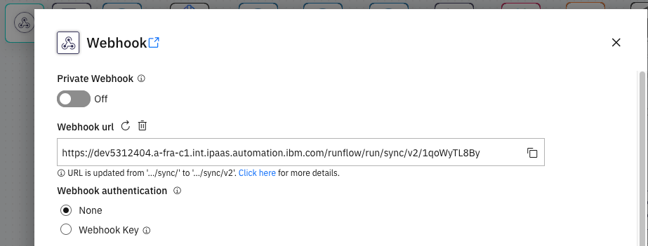
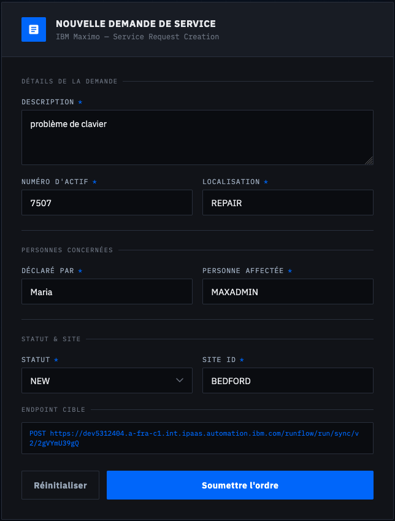
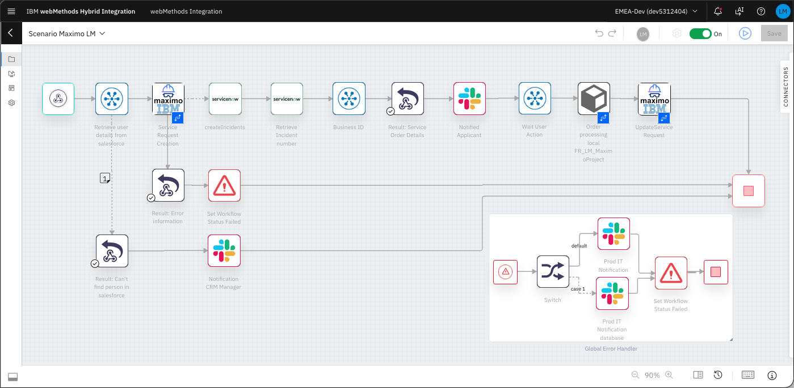
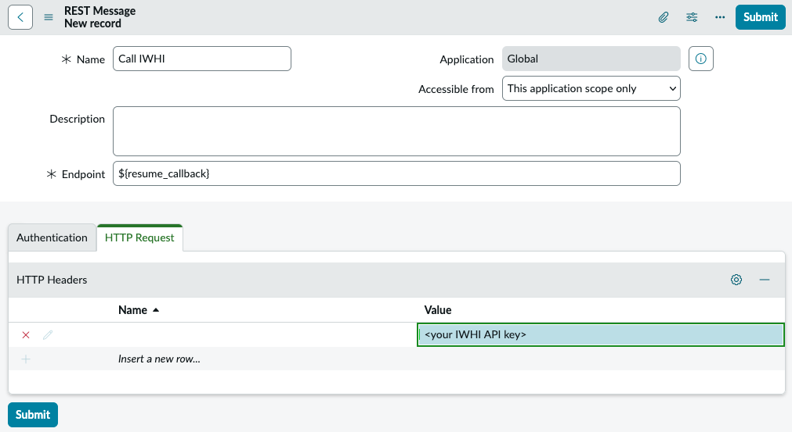
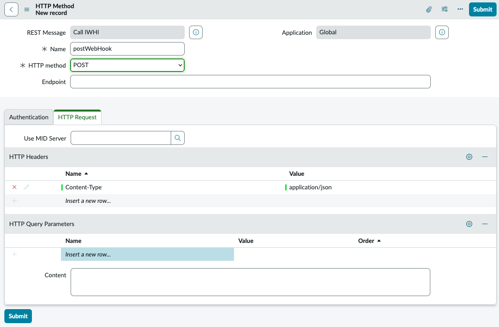
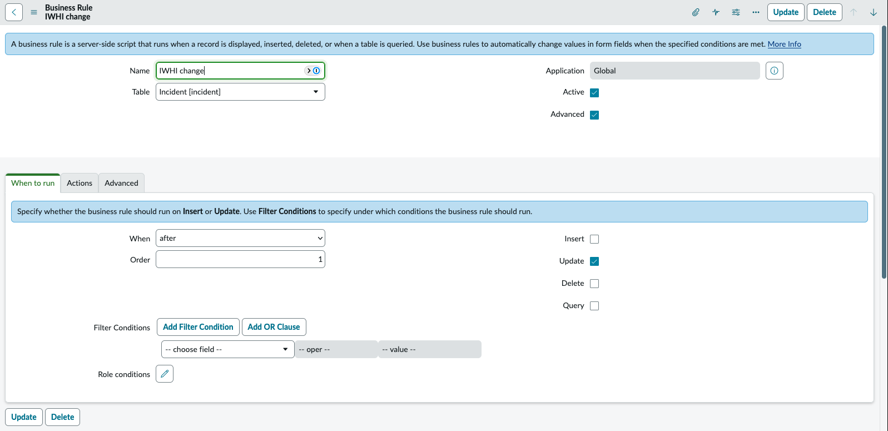
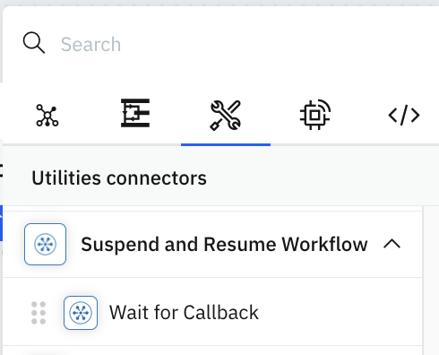
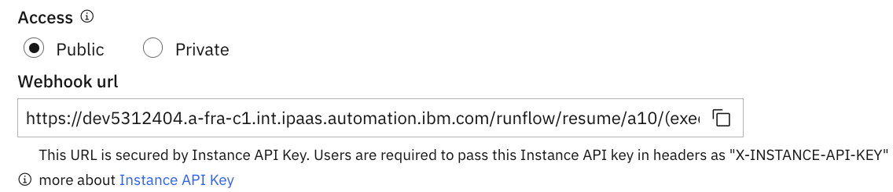

# IBM Maximo - webMethods Integration

<!-- markdownlint-disable MD033 -->

<!--
PANDOC_DEFAULTS_BEGIN
metadata:
  subtitle: "a scenario"
  author: "Laurent Martin"
PANDOC_DEFAULTS_END
-->

[](LICENSE)
[](https://www.ibm.com/products/maximo)
[](https://www.softwareag.com/en_corporate/platform/integration-apis/webmethods-integration.html)
[](https://www.openapis.org/)
[](https://nodejs.org/)

<!-- https://ebasso.net/wiki/index.php?title=IBM_Maximo:_Dicas_de_APIs_Rest -->

This repository provides tools, patterns and documentation for integrating IBM Maximo with enterprise applications using IBM webMethods Hybrid Integration Platform (IWHI).

## Demo Scenario

### Configuration

- Open the main workflow on webMethods Integration.
- Open the Settings of the first connector (webHook), either by double click, or selecting the cogwheel icon.



- Copy the URL displayed in the webHook settings.
- Paste in the configuration file: `form/server.yaml` for key `webMethods.url`

### Execution Environment Setup

- Start the Form server.

In separate web browser windows:

- Connect to the form. (URL Displayed by script)



- Open the workflow with tracing enabled.



- Log into ServiceNow.

- Log into Maximo.

## Overview

This integration enables bidirectional communication between Maximo and webMethods, supporting key integration patterns.

### webMethods Calling Maximo REST APIs


webMethods workflows can invoke Maximo REST APIs to:

- Query asset information
- Create or update work orders
- Retrieve service requests
- Perform CRUD operations on Maximo objects

The `/api` directory contains tools to process and optimize Maximo's OpenAPI specification for seamless import into webMethods.

### Maximo Triggering webMethods Workflows

When objects are modified in Maximo (create, update, delete), Maximo can automatically trigger webMethods workflows to:

- Notify external systems of changes
- Orchestrate business processes across multiple applications
- Synchronize data with other enterprise systems
- Execute automated workflows based on Maximo events

### Use Cases

- **Asset Management**: Sync asset data between Maximo and ERP systems
- **Work Order Automation**: Trigger workflows when work orders are created/updated
- **Service Request Processing**: Route service requests to appropriate systems
- **Inventory Management**: Update inventory across multiple platforms
- **Compliance Reporting**: Aggregate data from Maximo for reporting systems

### Prerequisites for scenarios

- IBM Maximo Application Suite (MAS) instance
- IBM webMethods Hybrid Integration Platform access
- Other enterprise applications, such as SAP, Oracle ERP, ServiceNow, Salesforce, etc.

The Maximo instance main URL has the format ([Documentation]()):

```text
https://<sub_domain>.<mas_domain>/
```

### Repository Structure

```text
├── images/                 # Screen captures for documentation
├── logo/                   # Logo for Maximo connector
├── maximo/                 # OpenAPI specification processing tools
│   ├── filter-by-path.js   # Filter relevant API endpoints
│   ├── fix-oas.js          # Fix and enhance OpenAPI spec
│   ├── Makefile            # Build pipeline for API spec
│   ├── redocly.yaml        # Redocly configuration
│   └── api/                # OpenAPI specification
│       ├── oas.json        # Source
│       ├── oas.small.json  # filtered and fixed version
│       ├── oas.small.yaml  # yaml of above
│       └── oas.yaml        # yaml of source
├── src/                    # code
│   └── service_now_business_rule.js # servicenow
└── README.md               # This file
```

## Pattern: webMethods Calling Maximo REST APIs

### Prerequisites

- IBM Maximo Application Suite (MAS) instance
- IBM webMethods Hybrid Integration Platform access
- Node.js (for API processing tools)
- Redocly CLI

### Processing Maximo OpenAPI Specification

> [!NOTE]
> This repo contains the already processed Maximo OpenAPI specification.
> So, no need to process it again, unless you need a different version.

1. Get the OpenAPI specification for Maximo Manage from your Maximo instance:

   ```text
   https://mas.manage.<mas_domain>/maximo/api/oas
   ```

> [!TIP]
> API documentation can be consulted at:
> `https://mas.manage.<mas_domain>/maximo/oas3/api.html`

1. Save it in the `api` directory as `oas.json` (or use the one already saved)

2. Run the build process:

   ```bash
   make
   ```

This will:

- Filter relevant API endpoints (`mxapisr`, `mxapiasset`)
- Bundle and optimize the specification
- Fix common issues (`operationIds`, enum types, server URLs)
- Validate the output
- Generate a clean OpenAPI spec ready for webMethods import

Import the processed OpenAPI specification into webMethods to:

- Auto-generate service connectors
- Build workflows that interact with Maximo
- Leverage Maximo's REST API capabilities

### Creation of the Connector in webMethods

- Open your webMethods Integration interface, and navigate to a project.

- Navigate to **Connectors** &rarr; **REST**

- Click **Add Connector**

  - Select **Import from URL**

  - Use this URL:

  ```text
  https://raw.githubusercontent.com/laurent-martin/ibm-maximo-webmethods/refs/heads/main/maximo/api/oas.small.json
  ```

  - **API Type**: Open API (v3)

  - **Next**

> [!NOTE]
> If you have cloned this repo, or recompiled the openapi spec, you can use **Import from local file** and use `oas.small.json`.

- **Name**: `Maximo`

- **Update icon**: Use the file: [logo/maximo_logo_128_round.png](logo/maximo_logo_128_round.png)

- **Authentication type**: `Credentials`

- **Next**

- **Finish**

### Saving the Maximo API Key for re-use

Maximo's credentials are using an API Key.

So, one way to externalize that secret is to create a workflow parameter:

- In the project navigate to: **Configurations**

- Then: **Workflow** &rarr; **Parameter**

- Click **New Parameter**

- **Name**: `MAXIMO_API_KEY`

- **Value**: `<your Maximo API Key>`

- Enable: **Set as password field**

- **Create**

### Using the connector in a workflow

- Create a new workflow.

- Search for `Maximo`

- Select and add the `Maximo` connector

- Double click on it to configure it.

- Select an action, for example: `CreateSR`

- For **Connect to Maximo**, click on `+` to create a configuration.

  - **Authorization Type**: `none`

  - **Hostname verifier**: `org.apache.http.conn.ssl.NoopHostnameVerifier` (To avoid SSL errors)

  - Leave the other parameters to the default values.

  - **Save**

- **Next**

- Fill the following parameters:

  - `lean`: `1`

  - `apikey`: **Parameters** &rarr; `MAXIMO_API_KEY`

  - `properties` ... follow the API of Maximo...

## Pattern: ServiceNow Triggering or Resuming a webMethods Workflow

### Preparation in ServiceNow

- In **ServiceNow**

- Go to: `All > System Web Services > Outbound > REST Message`

- Create a REST Message (Endpoint):

  

  - Name: `Call IWHI`
  - Endpoint: Paste as: `${resume_callback}`
  - HTTP Request: add Header:
    - `X-INSTANCE-API-KEY`: `<your IWHI API key>`
  - Submit

- Open the newly created REST Message:

  

  - Delete the `GET` method (unused, open and click *Delete*)
  - Create a new Method:
  - Name: `postWebHook`
  - HTTP Method: `POST`
  - HTTP Request: Headers:
    - `Content-Type`: `application/json`
  - Leave the others empty.
  - Submit

- Go to: `All > System Definitions > Business Rules`

- Create a business Rule:

  

  - Name: `IWHI on Incident Change`
  - **Table**: `Incident`
  - **Active**: `Yes`
  - **Advanced**: `Yes`
  - **When to Run**
    - **When**: `after`
    - **Update**: `Yes`
  - **Advanced**:
    - Turn on ES12 mode: `Yes`
    - Script: [JavaScript](src/service_now_business_rule.js)

> [!NOTE]
> The field: `current.correlation_display` is populated at incident creation time by IWHI Integration with the full URL to the callback on IWHI.
> `correlation_id` can be used to store the Maximo SR ID.

### Resume Workflow in webMethods

- In **webMethods** Integration
- In your workflow, insert a utility connector: `Wait for Callback` in section `Suspend and Resume Workflow`

  

  In the configuration form: Copy the Webhook URL:
  
  `https://<your-iwhi-instance>/runflow/resume/<step id>/(execution_id)`

  

## Micro Service Runtime (MSR)

The workflow simulates an on-premise service by using an Integration MSR accessing a database.

## About

### License

This project is licensed under the Apache License 2.0 - see the [LICENSE](LICENSE) file for details.

### Contributing

Contributions are welcome! Please feel free to submit issues or pull requests.

## Documentation

- [Maximo REST API Documentation](https://www.ibm.com/docs/en/maximo-manage/continuous-delivery?topic=apis-maximo-rest-api)
- [webMethods Integration Documentation](https://documentation.softwareag.com/)

### Support

For issues related to:

- **Maximo**: Consult IBM Maximo documentation or support
- **webMethods**: Consult IBM webMethods documentation or support
- **This repository**: Open an issue on GitHub

## Annex: Creation of Maximo connector

Go to your project, then Connectors, then REST, then

- URL: `https://mas-ui.manage.mas.apps.699b61e4b4668359d903183a.eu1.techzone.ibm.com/maximo/api`
- Authorization type: none
- Hostname verifier: `org.apache.http.conn.ssl.NoopHostnameVerifier`

## Annex: Demo environment "self-managed" on macOS

For the self-managed part, we deploy containers on macOS.
The following setup is used:

```bash
brew install podman 
```

```bash
podman machine init --cpus 4 --memory 4096 --disk-size 50
podman machine start
```

## Annex: Creation of on-premise database

Create a volume to have some persistency of the database:

```bash
podman volume create mysql-data
```

set database password in secrets.yml and set variable:

```shell
DB_PASSWORD=$(yq '.database.password' secrets.yaml)
```

The on-premise database runs in a container and is started like this:

```bash
podman run --detach --publish 3306:3306 --name=mysql --hostname=mysql-svc -e MYSQL_ROOT_PASSWORD=$DB_PASSWORD --volume mysql-data:/var/lib/mysql mysql:latest
```

> [!NOTE]
> `mysql-svc` is a hostname visible by other containers, such as the Micro Service Runtime.

Create the database and table:

```bash
podman exec -i mysql mysql -u root -p$DB_PASSWORD < src/database_init.sql
```

## Annex: Available Maximo Objects in IBM App Connect

The following Maximo objects are available for integration in IBM App Connect:

```text
IBM Maximo Asset Management is an enterprise asset management solution that enterprises can use for asset management, procurement and materials management, service management, work management, and contract management.
More info

Assets (mxapiasset)
Assets (mxasset)
Companies (mxapivendor)
Contracts (mxapicontract)
Crafts (mxapicraft)
Labors (mxapilabor)
Locations (mxapilocations)
Person groups (mxapipersongroup)
Person users (mxapiperuser)
Purchase orders (mxapipo)
Service addresses (mxapiseraddress)
Service requests (mxapisr)
Create service request
Retrieve service requests
Update service request
Update or create service request
Delete service request
Download service requests as CSV
Replace or create service request
Replace service request
Work orders (mxapiwo)
```

Fields in Maximo Create SR:

| Field                         | Value                        |
|-------------------------------|------------------------------|
| `lean`                        | `1`                          |
| `Content-Type`                | `application/json`           |
| `properties`                  | `ticketuid,ticketid,reportedby,assetnum,reportedphone,reportedemail,location,affectedpersonid,reportdate,description` |
| `apikey`                      | `{{$project.params.apiKey}}` |
| `Accept`                      | `application/json`           |
| `description_longdescription` | `Request : {{$request.body.description}} FROM webSite application AT : {{$transform.t2.value}} BY:{{$request.body.reportedby}} FOR THE ASSET: {{$request.body.assetnum}}` |
| `siteid`                      | `{{$request.body.SITEID}}`   |
| `affectedperson`              | `{{$request.body.affectedpersonid}}` |
| `description`                 | `{{$request.body.description}}` |
| `urgency`                     | `2`                          |
| `location`                    | `{{$request.body.location}}` |
| `status`                      | `{{$request.body.status}}`   |
| `reportedby`                  | `{{$request.body.reportedby}}` |
| `assetnum`                    | `{{$request.body.assetnum}}` |
| `reportedemail`               | `{{$a5.Contact[0].Email}}`   |
| `reportedphone`               | `{{$a5.Contact[0].Phone}}`   |

Fields in Maximo Update SR:

| Field                         | Value                        |
|-------------------------------|------------------------------|
| `lean`                        | `1`                          |
| `id`                          | `{{$transform.t3.stringifiedObject}}` |
| `Content-Type`                | `application/json`           |
| `Accept`                      | `application/json`           |
| `apikey`                      | `{{$project.params.apiKey}}` |
| `x-method-override`           | `PATCH`                      |
| `description_longdescription` | `Request : {{$request.body.description}} FROM webSite application AT : {{$transform.t2.value}} BY:{{$request.body.reportedby}} FOR THE ASSET: {{$request.body.assetnum}} CLOSED BY SERVICENOW` |

order_id {{$a30.CreateSROutput.responseBody.post200CreateSRResponse.ticketid}}

first_name {{$a5.Contact[0].FirstName}}

last_name {{$a5.Contact[0].LastName}}

customer {{$a5.Contact[0].Department}}

product_name Mechanical Keyboard

product_code {{$a20.postosMxapisrOutput.responseBody.post200postosMxapisrResponse.assetnum}}

delivery_date {{$transform.t1.value}}

quantity 1

email_opt_in {{$a5.Contact[0].Email}}

comment {{$a20.postosMxapisrOutput.responseBody.post200postosMxapisrResponse.description}}

end to end monitoring
MCP
